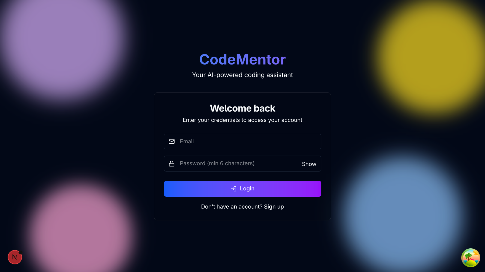
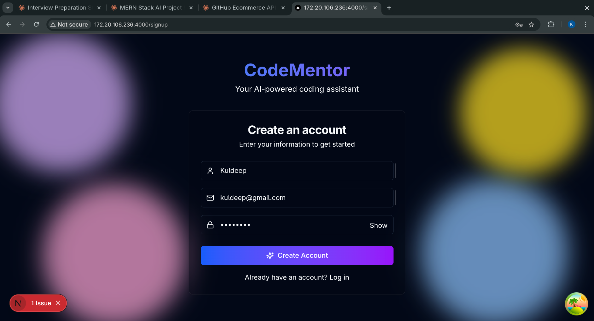
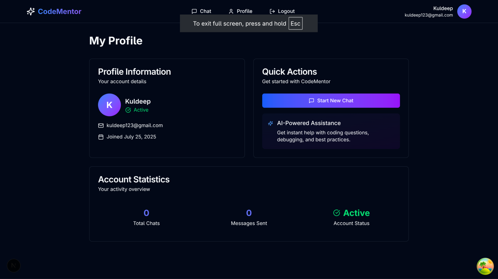
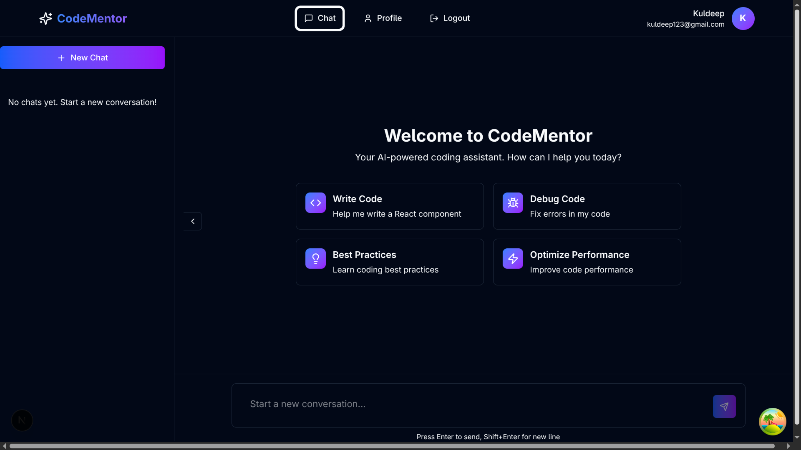
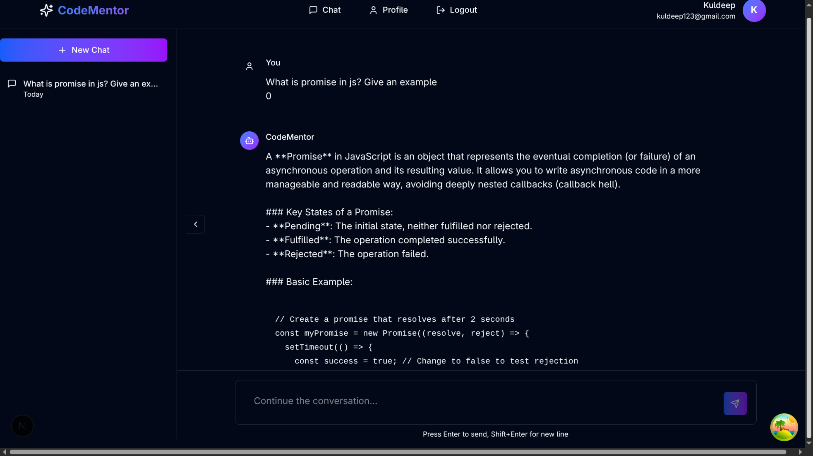
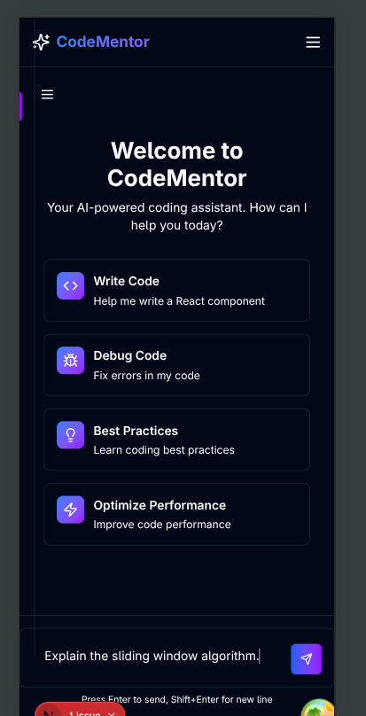

```markdown
# CodeMentor - AI-Powered Coding Assistant 🚀

<div align="center">
  
  <p>
    <strong>Your intelligent coding companion powered by OpenAI</strong>
  </p>
  <p>
    <a href="#features">Features</a> •
    <a href="#tech-stack">Tech Stack</a> •
    <a href="#getting-started">Getting Started</a> •
    <a href="#screenshots">Screenshots</a> •
    <a href="#contributing">Contributing</a>
  </p>
  <p>
    
    
    
    
    
  </p>
</div>

## 📖 Overview

CodeMentor is a modern, full-stack web application that provides AI-powered coding assistance. Built with Next.js, Express, MongoDB, and OpenAI's GPT, it offers real-time chat functionality with syntax highlighting, code formatting, and persistent conversation history.

## ✨ Features

- 🔐 **Secure Authentication**: JWT-based auth with refresh tokens
- 💬 **Real-time AI Chat**: Powered by OpenAI GPT for intelligent responses
- 🎨 **Modern UI/UX**: Beautiful glass morphism design with smooth animations
- 📝 **Code Highlighting**: Syntax highlighting for multiple programming languages
- 💾 **Persistent History**: Save and manage all your conversations
- 📱 **Responsive Design**: Works seamlessly on desktop and mobile devices
- 🌓 **Dark/Light Mode**: Automatic theme detection and manual toggle
- ⚡ **Optimistic Updates**: Instant UI feedback for better user experience
- 🔍 **Markdown Support**: Rich text formatting in messages
- ⌨️ **Keyboard Shortcuts**: Quick actions for power users

## 🛠️ Tech Stack

### Frontend
- **Framework**: Next.js 14 (App Router)
- **Language**: TypeScript
- **Styling**: Tailwind CSS
- **UI Components**: Custom components with Radix UI
- **State Management**: React Query (TanStack Query)
- **Animations**: Framer Motion
- **Forms**: React Hook Form + Zod validation
- **HTTP Client**: Axios

### Backend
- **Framework**: Express.js
- **Language**: TypeScript
- **Database**: MongoDB with Mongoose
- **Authentication**: JWT (jsonwebtoken)
- **AI Integration**: OpenAI API
- **Security**: Helmet, CORS, bcrypt
- **Validation**: Zod
- **Rate Limiting**: express-rate-limit

## 🚀 Getting Started

### Prerequisites

- Node.js 18+ 
- MongoDB (local or Atlas)
- OpenAI API key
- Git

### Installation

1. **Clone the repository**
   ```bash
   git clone https://github.com/cygnus07/codementor.git
   cd codementor
   ```

2. **Install dependencies**
   ```bash
   # Install backend dependencies
   cd server
   npm install

   # Install frontend dependencies
   cd ../client
   npm install
   ```

3. **Environment Setup**

   Backend (.env):
   ```bash
   cd server
   cp .env.example .env
   ```
   
   Edit `server/.env`:
   ```env
   # Server
   NODE_ENV=development
   PORT=5000

   # Database
   DATABASE_TYPE=mongodb
   MONGODB_URI=mongodb://localhost:27017/codementor

   # OpenAI
   OPENAI_API_KEY=your-openai-api-key
   OPENAI_MODEL=gpt-4-turbo-preview

   # Security
   JWT_SECRET=your-super-secret-jwt-key
   JWT_REFRESH_SECRET=your-super-secret-refresh-key
   JWT_EXPIRES_IN=24h
   JWT_REFRESH_EXPIRES_IN=7d
   BCRYPT_ROUNDS=12

   # CORS
   CORS_ORIGIN=http://localhost:3000
   ```

   Frontend (.env.local):
   ```bash
   cd ../client
   echo "NEXT_PUBLIC_API_URL=http://localhost:5000/api" > .env.local
   ```

4. **Run the application**

   In separate terminals:
   ```bash
   # Terminal 1 - Backend
   cd server
   npm run dev

   # Terminal 2 - Frontend
   cd client
   npm run dev
   ```

5. **Access the application**
   - Frontend: http://localhost:3000
   - Backend API: http://localhost:5000/api

## 📸 Screenshots

<div align="center">
  
  <p><em>Login Page with Glass Morphism Design</em></p>
</div>

<div align="center">
  
  <p><em>Signup Page</em></p>
</div>

<div align="center">
  
  <p><em>User Profile Dashboard</em></p>
</div>

<div align="center">
  
  <p><em>Chat Interface - Empty State</em></p>
</div>

<div align="center">
  
  <p><em>Active Chat Conversation with Code Highlighting</em></p>
</div>

<div align="center">
  
  <p><em>Mobile Responsive Design</em></p>
</div>

## 🏗️ Project Structure

```
codementor/
├── client/                    # Next.js frontend
│   ├── app/                  # App router pages
│   ├── components/           # React components
│   ├── lib/                  # Utilities and hooks
│   └── public/              # Static assets
└── server/                   # Express backend
    ├── src/
    │   ├── controllers/      # Route controllers
    │   ├── models/          # MongoDB models
    │   ├── routes/          # API routes
    │   ├── services/        # Business logic
    │   └── middleware/      # Express middleware
    └── dist/                # Compiled JavaScript
```

## 🔧 Configuration

### Frontend Configuration
- Modify `tailwind.config.js` for custom styling
- Update `next.config.js` for Next.js settings
- Customize theme in `app/globals.css`

### Backend Configuration
- Adjust rate limiting in `app.ts`
- Modify OpenAI settings in `services/openai.service.ts`
- Configure CORS origins for production

## 📚 API Documentation

### Authentication Endpoints
- `POST /api/auth/signup` - Register new user
- `POST /api/auth/login` - Login user
- `POST /api/auth/refresh` - Refresh access token
- `GET /api/auth/profile` - Get user profile

### Chat Endpoints
- `POST /api/chats` - Create new chat
- `GET /api/chats` - Get user's chats
- `GET /api/chats/:id` - Get chat messages
- `POST /api/chats/:id/messages` - Send message
- `PATCH /api/chats/:id` - Update chat title
- `DELETE /api/chats/:id` - Delete chat

## 🚢 Deployment

### Backend Deployment (Heroku/Railway/Render)
1. Set environment variables in your platform
2. Ensure MongoDB Atlas connection
3. Update CORS origins for production

### Frontend Deployment (Vercel/Netlify)
1. Connect GitHub repository
2. Set `NEXT_PUBLIC_API_URL` to production API
3. Deploy

## 🤝 Contributing

Contributions are welcome! Please feel free to submit a Pull Request.

1. Fork the repository
2. Create your feature branch (`git checkout -b feature/AmazingFeature`)
3. Commit your changes (`git commit -m 'Add some AmazingFeature'`)
4. Push to the branch (`git push origin feature/AmazingFeature`)
5. Open a Pull Request

## 📝 License

This project is licensed under the MIT License - see the [LICENSE](LICENSE) file for details.

## 🙏 Acknowledgments

- OpenAI for providing the GPT API
- Next.js team for the amazing framework
- All contributors and users of CodeMentor

## 📞 Support

For support, email kuldeepsingh21070@gmail.com or open an issue in this repository.

---

<div align="center">
  Made with ❤️ by Kuldeep Singh
  <br />
  <a href="https://github.com/cygnus07/codementor">⭐ Star this repository</a>
</div>
```

# Frontend README (codementor/client/README.md)

```markdown
# CodeMentor Frontend

Next.js-based frontend for the CodeMentor AI coding assistant.

## 🚀 Quick Start

```bash
# Install dependencies
npm install

# Run development server
npm run dev

# Build for production
npm run build

# Start production server
npm start
```

## 📁 Project Structure

```
client/
├── app/                      # Next.js App Router
│   ├── (auth)/              # Authentication pages
│   │   ├── login/           # Login page
│   │   └── signup/          # Signup page
│   ├── (dashboard)/         # Protected pages
│   │   ├── chat/            # Chat interface
│   │   └── profile/         # User profile
│   ├── layout.tsx           # Root layout
│   └── globals.css          # Global styles
├── components/              # React components
│   ├── auth/               # Auth-related components
│   ├── chat/               # Chat components
│   ├── layout/             # Layout components
│   ├── providers/          # Context providers
│   └── ui/                 # Reusable UI components
├── lib/                    # Utilities
│   ├── api/               # API client functions
│   ├── hooks/             # Custom React hooks
│   ├── utils/             # Helper functions
│   └── validations.ts     # Zod schemas
├── types/                  # TypeScript types
└── public/                 # Static assets
```

## 🎨 Key Components

### Authentication
- `LoginForm` - Handles user login with validation
- `SignupForm` - User registration with password requirements
- `useAuth` - Custom hook for authentication state

### Chat Interface
- `ChatSidebar` - Displays chat history and management
- `ChatInput` - Message input with auto-resize
- `MessageComponent` - Renders messages with formatting
- `EmptyChat` - Shows suggestions when no messages

### UI Components
- `Button` - Styled button with variants
- `Input` - Form input with validation states
- `Card` - Container component with glass morphism
- `CodeBlock` - Syntax highlighted code display

## 🔧 Configuration

### Environment Variables
Create `.env.local`:
```env
NEXT_PUBLIC_API_URL=http://localhost:5000/api
```

### Tailwind Configuration
Customize theme in `tailwind.config.js`:
- Colors
- Fonts
- Breakpoints
- Animations

## 🎯 Features

- **Server-Side Rendering**: Optimized for SEO and performance
- **Type Safety**: Full TypeScript support
- **Form Validation**: Zod schemas with React Hook Form
- **State Management**: React Query for server state
- **Animations**: Framer Motion for smooth transitions
- **Responsive Design**: Mobile-first approach
- **Dark Mode**: System preference detection

## 📦 Dependencies

### Core
- `next`: 14.x - React framework
- `react`: 18.x - UI library
- `typescript`: 5.x - Type safety

### UI/UX
- `tailwindcss`: CSS framework
- `framer-motion`: Animations
- `lucide-react`: Icon library
- `sonner`: Toast notifications

### Data/Forms
- `@tanstack/react-query`: Server state
- `react-hook-form`: Form handling
- `zod`: Schema validation
- `axios`: HTTP client

## 🚀 Scripts

```bash
# Development
npm run dev          # Start dev server

# Production
npm run build        # Build for production
npm start           # Start production server

# Code Quality
npm run lint        # Run ESLint
npm run type-check  # TypeScript check
```

## 🔍 Code Standards

- Use TypeScript for all components
- Follow React best practices
- Implement proper error boundaries
- Write accessible markup
- Optimize for performance

## 🐛 Common Issues

### Build Errors
- Clear `.next` folder: `rm -rf .next`
- Reinstall dependencies: `rm -rf node_modules && npm install`

### Type Errors
- Update TypeScript: `npm update typescript`
- Check `tsconfig.json` settings

### Style Issues
- Ensure Tailwind imports in `globals.css`
- Check PostCSS configuration
```

# Backend README (codementor/server/README.md)

```markdown
# CodeMentor Backend

Express.js-based REST API for the CodeMentor AI coding assistant.

## 🚀 Quick Start

```bash
# Install dependencies
npm install

# Run development server
npm run dev

# Build TypeScript
npm run build

# Start production server
npm start
```

## 📁 Project Structure

```
server/
├── src/
│   ├── index.ts              # Server entry point
│   ├── app.ts               # Express configuration
│   ├── config/              # Configuration files
│   │   ├── db.ts           # Database connection
│   │   ├── environment.ts  # Environment validation
│   │   └── passport.ts     # JWT strategy
│   ├── controllers/         # Route handlers
│   │   ├── auth.controller.ts
│   │   └── chat.controller.ts
│   ├── middleware/          # Express middleware
│   │   ├── auth.ts         # Authentication
│   │   ├── errorHandler.ts # Error handling
│   │   └── requestLogger.ts # Logging
│   ├── models/             # MongoDB schemas
│   │   ├── user.model.ts
│   │   ├── chat.model.ts
│   │   └── message.model.ts
│   ├── routes/             # API routes
│   │   ├── auth.ts
│   │   ├── chat.ts
│   │   └── index.ts
│   ├── services/           # Business logic
│   │   ├── auth.service.ts
│   │   ├── chat.service.ts
│   │   └── openai.service.ts
│   ├── types/              # TypeScript types
│   └── utils/              # Helper functions
│       ├── jwt.ts
│       └── validation.ts
└── dist/                   # Compiled JavaScript
```

## 🔧 Configuration

### Environment Variables
Create `.env`:
```env
# Server
NODE_ENV=development
PORT=5000

# Database
DATABASE_TYPE=mongodb
MONGODB_URI=mongodb://localhost:27017/codementor

# Security
JWT_SECRET=your-jwt-secret-key-change-in-production
JWT_REFRESH_SECRET=your-refresh-secret-key
JWT_EXPIRES_IN=24h
JWT_REFRESH_EXPIRES_IN=7d
BCRYPT_ROUNDS=12

# OpenAI
OPENAI_API_KEY=sk-your-openai-api-key
OPENAI_MODEL=gpt-4-turbo-preview

# CORS
CORS_ORIGIN=http://localhost:3000

# Email (optional)
EMAIL_HOST=smtp.gmail.com
EMAIL_PORT=587
EMAIL_USER=your-email@gmail.com
EMAIL_PASS=your-app-password
EMAIL_FROM=noreply@codementor.com
```

## 📚 API Endpoints

### Authentication
```
POST   /api/auth/signup     - Register new user
POST   /api/auth/login      - Login user  
POST   /api/auth/refresh    - Refresh token
GET    /api/auth/profile    - Get profile (protected)
```

### Chat Management
```
POST   /api/chats           - Create new chat
GET    /api/chats           - Get all user chats
GET    /api/chats/:id       - Get chat with messages
POST   /api/chats/:id/messages - Send message
PATCH  /api/chats/:id       - Update chat title
DELETE /api/chats/:id       - Delete chat
```

### Health Check
```
GET    /api/health          - Server health status
```

## 🔐 Security Features

- **Password Hashing**: bcrypt with configurable rounds
- **JWT Authentication**: Access & refresh tokens
- **Rate Limiting**: Prevents brute force attacks
- **CORS**: Configured for specific origins
- **Helmet**: Security headers
- **Input Validation**: Zod schemas
- **MongoDB Injection Prevention**: Mongoose sanitization

## 📦 Dependencies

### Core
- `express`: Web framework
- `mongoose`: MongoDB ODM
- `typescript`: Type safety

### Security
- `jsonwebtoken`: JWT tokens
- `bcryptjs`: Password hashing
- `helmet`: Security headers
- `cors`: Cross-origin support

### Utilities
- `zod`: Schema validation
- `openai`: AI integration
- `morgan`: HTTP logging
- `compression`: Response compression

## 🧪 API Testing

### Using cURL

```bash
# Register
curl -X POST http://localhost:5000/api/auth/signup \
  -H "Content-Type: application/json" \
  -d '{"email":"test@example.com","password":"password123","name":"Test User"}'

# Login
curl -X POST http://localhost:5000/api/auth/login \
  -H "Content-Type: application/json" \
  -d '{"email":"test@example.com","password":"password123"}'

# Create chat (with token)
curl -X POST http://localhost:5000/api/chats \
  -H "Content-Type: application/json" \
  -H "Authorization: Bearer YOUR_TOKEN" \
  -d '{"message":"Hello, can you help me with React?"}'
```

## 🚀 Scripts

```bash
# Development
npm run dev          # Run with hot reload

# Production
npm run build        # Compile TypeScript
npm start           # Run compiled code

# Code Quality
npm run lint        # ESLint check
npm run format      # Prettier format
```

## 🏗️ Database Schema

### User
- email (unique, required)
- password (hashed)
- name
- isActive
- lastLogin
- timestamps

### Chat
- userId (reference)
- title
- messages (array of references)
- isActive
- lastMessageAt
- timestamps

### Message
- chatId (reference)
- role (user/assistant/system)
- content
- tokens
- createdAt

## 🐛 Troubleshooting

### MongoDB Connection
- Ensure MongoDB is running
- Check connection string
- Verify network access for Atlas

### OpenAI API
- Verify API key is valid
- Check rate limits
- Monitor token usage

### JWT Issues
- Ensure secrets are set
- Check token expiration
- Verify refresh flow
```

# Screenshot Instructions (codementor/screenshots/README.md)

```markdown
# Screenshot Guide

Please take screenshots of the following pages and save them with these exact names:

## Required Screenshots

1. **login.png**
   - The login page with email and password fields
   - Show the glass morphism effect and gradient background

2. **signup.png**
   - The signup page with all form fields
   - Capture the animated background

3. **profile.png**
   - User profile page after login
   - Show user information and quick actions

4. **chat-empty.png**
   - Chat page with no messages
   - Display the suggestion cards

5. **chat-conversation.png**
   - Active chat with messages
   - Include examples with code blocks
   - Show both user and AI messages

6. **chat-mobile.png**
   - Mobile view of the chat interface
   - Show the collapsible sidebar

7. **logo.png** (optional)
   - Your app logo or create a simple one
   - Recommended size: 512x512px

## How to Take Good Screenshots

1. **Clear your browser cache** first
2. **Use Chrome DevTools** for consistent screenshots
3. **Disable browser extensions** that might interfere
4. **For mobile**: Use device emulation in DevTools
5. **Resolution**: Aim for 1920x1080 for desktop, 375x812 for mobile

## Example Screenshot Commands (macOS)

```bash
# Full screen
Cmd + Shift + 3

# Selected area
Cmd + Shift + 4

# Window
Cmd + Shift + 4, then Space
```

## Tips for Great Screenshots

- ✅ Show real content (not lorem ipsum)
- ✅ Demonstrate key features
- ✅ Use good lighting/contrast
- ✅ Capture hover states where relevant
- ❌ Don't include personal information
- ❌ Avoid showing errors or bugs
```